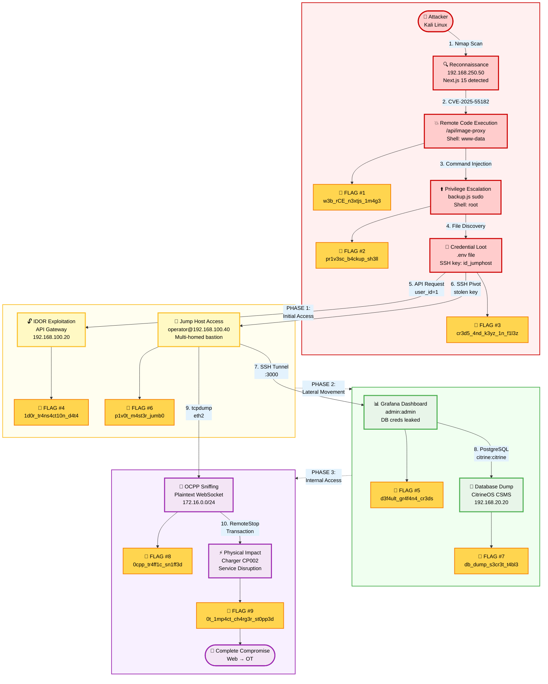
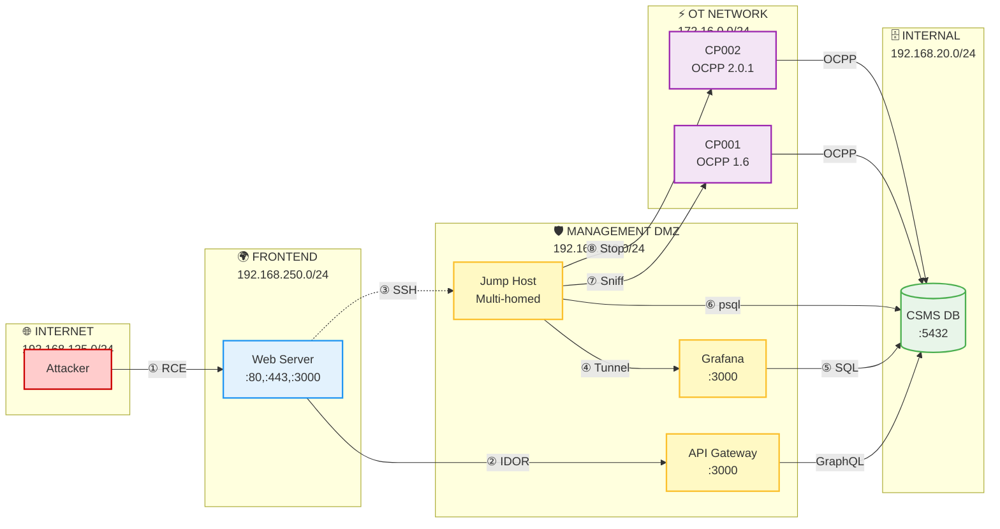
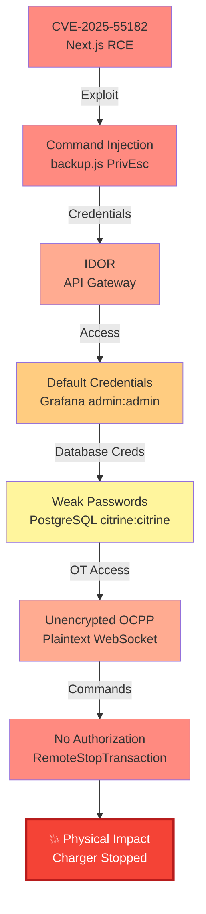
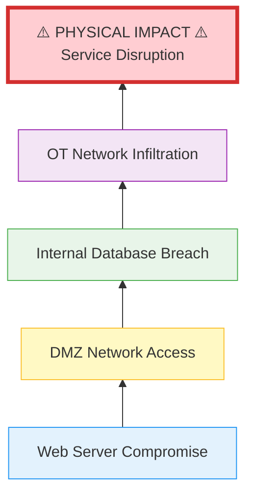

# EcoCharge Attack Flow - Візуальна Діаграма

**Призначення:** Презентація для наукового керівника  
**Формат:** Mermaid діаграма (рендериться в GitHub, Obsidian, VS Code)

---

## Attack Flow Diagram



---

## Attack Timeline

```mermaid
gantt
    title EcoCharge Attack Progression
    dateFormat HH:mm
    axisFormat %H:%M
    
    section Phase 1
    Reconnaissance       :done, p1a, 10:00, 10:15
    RCE Exploitation     :done, p1b, 10:15, 10:30
    Privilege Escalation :done, p1c, 10:30, 10:45
    Credential Discovery :done, p1d, 10:45, 11:00
    
    section Phase 2
    IDOR Attack         :done, p2a, 11:00, 11:15
    SSH Pivoting        :done, p2b, 11:15, 11:30
    
    section Phase 3
    Grafana Access      :done, p3a, 11:30, 11:45
    Database Dump       :done, p3b, 11:45, 12:00
    
    section Phase 4
    OCPP Sniffing       :done, p4a, 12:00, 12:20
    Physical Impact     :crit, p4b, 12:20, 12:30
```



---

## Network Flow Diagram



---

## Vulnerability Chain



---

## Impact Pyramid



---

## Технічна інформація

**Автор:** Claude Assistant  
**Дата:** 9 лютого 2026  
**Призначення:** Дипломна робота - Cyber Range для захисту інфраструктури електрозаправок  
**Формат:** Mermaid.js (сумісно з GitHub, GitLab, Obsidian, VS Code)

### Як використовувати:

1. **GitHub/GitLab:** Скопіювати мермаїд блоки в .md файл - автоматично рендеряться
2. **PowerPoint:** Використати [Mermaid Chart](https://www.mermaidchart.com/) для експорту в PNG/SVG
3. **LaTeX:** Конвертувати в PDF через pandoc або mermaid-cli
4. **Презентація:** Імпортувати SVG у PowerPoint/Google Slides

### Команди для експорту:

```bash
# Встановити mermaid-cli
npm install -g @mermaid-js/mermaid-cli

# Конвертувати в PNG (висока якість)
mmdc -i attack_flow_diagram.md -o attack_flow.png -w 2400 -H 1800 -b transparent

# Конвертувати в SVG (векторна графіка)
mmdc -i attack_flow_diagram.md -o attack_flow.svg -b transparent

# Конвертувати в PDF
mmdc -i attack_flow_diagram.md -o attack_flow.pdf
```
