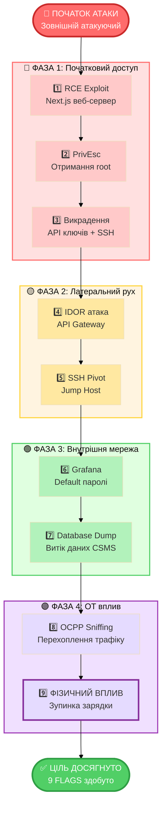
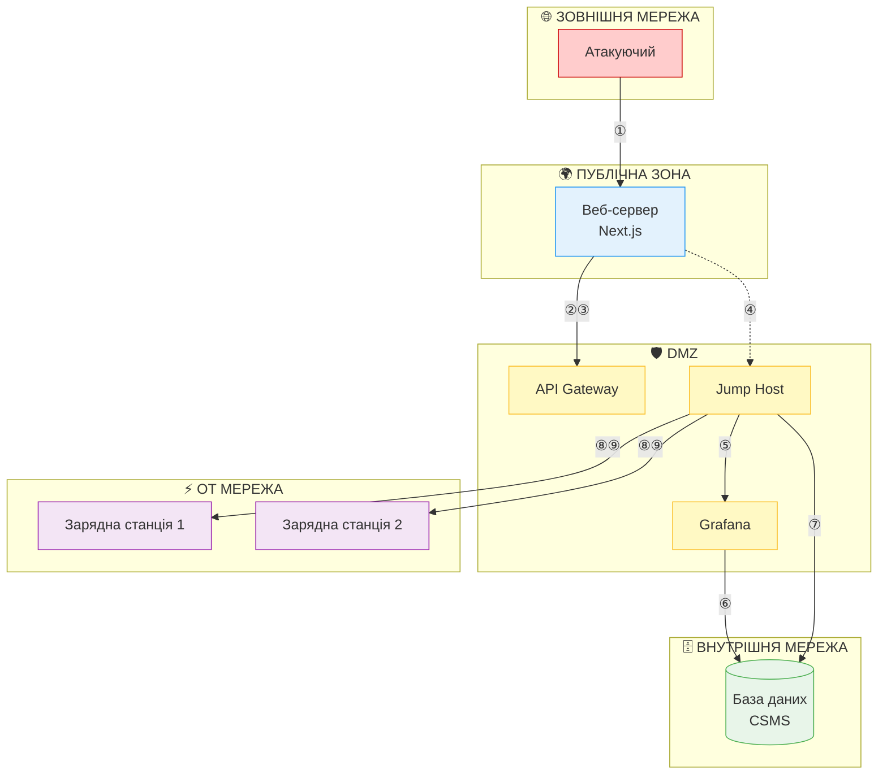

# EcoCharge Attack Flow - Презентаційна Діаграма

**Для друку / презентації науковому керівнику**

---

## Спрощена діаграма (для слайдів)

---

## Мережева топологія (для схеми)

---

## Ланцюжок вразливостей

---

## Статистика атаки

| Метрика | Значення |
|---------|----------|
| **Кількість фаз** | 4 |
| **Здобутих FLAGS** | 9 |
| **Компрометованих зон** | 5 з 5 (100%) |
| **Критичних вразливостей** | 7 |
| **Час атаки** | ~2.5 години |
| **Вплив** | Зупинка зарядної станції |

---

## Ключові висновки

### ✅ Продемонстровано:
1. Повний ланцюжок атаки від Web до OT
2. Реалістичні вразливості критичної інфраструктури
3. Важливість сегментації мережі
4. Вплив на фізичне обладнання

### ⚠️ Критичні проблеми:
1. **RCE у публічному веб-додатку** → Initial access
2. **Відсутність мережевої ізоляції** → Lateral movement
3. **Default/weak credentials** → Privilege escalation
4. **Незашифрований OCPP** → OT compromise
5. **Відсутність авторизації команд** → Physical impact

### 🎯 Навчальна цінність:
- Демонстрація Defense in Depth principles
- Практичне розуміння OT security
- Hands-on досвід з OCPP протоколом
- Red Team / Blue Team scenario

---

**Дата:** 9 лютого 2026  
**Версія:** 3.0  
**Призначення:** Дипломна робота - Cyber Range для електрозаправок
