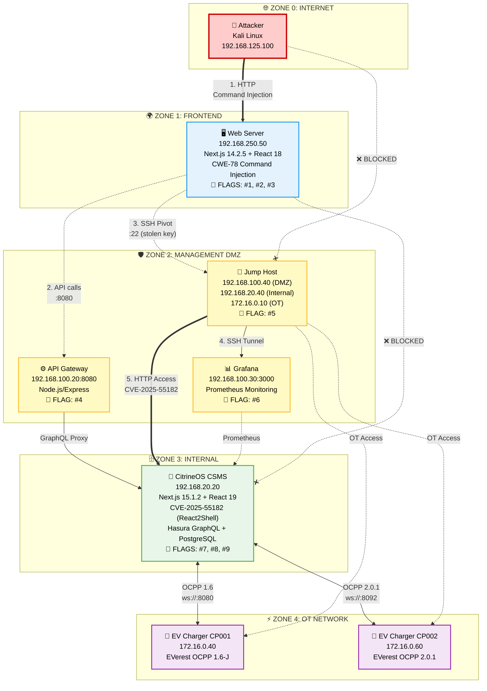

# EcoCharge CTF Scenario - Network Topology Documentation v4

## Документ: Опис мережевої інфраструктури Cyber Range

**Версія:** 4.0  
**Дата оновлення:** Лютий 2025

---

## 1. Концепція Архітектури

Інфраструктура EcoCharge реалізує **5-рівневу модель сегментації мережі** згідно з принципами Defense in Depth. Архітектура імітує реальну інфраструктуру регіонального оператора мережі зарядних станцій для електротранспорту.

**Ключова особливість:** Веб-сервер винесено в окрему зону "Frontend" для ізоляції публічних сервісів від управлінської DMZ, що відповідає сучасним практикам кібербезпеки.

### Мережева сегментація:

1. **Internet / WAN (192.168.125.0/24)** — Мережа атакуючого
2. **Frontend Zone (192.168.250.0/24)** — Публічний веб-додаток EcoCharge
3. **Management DMZ (192.168.100.0/24)** — Сервіси управління та моніторингу
4. **Internal Zone (192.168.20.0/24)** — CitrineOS CSMS (ядро системи)
5. **OT Network (172.16.0.0/24)** — Operational Technology (зарядні станції)

---

## 2. Мережева Топологія

### 2.1 Візуальна діаграма



### 2.2 Таблиця мережевих сегментів

| Зона | CIDR | VLAN | Gateway | Призначення | Правила доступу |
|------|------|------|---------|-------------|-----------------|
| **Internet** | 192.168.125.0/24 | WAN | ISP Router | Мережа атакуючого | ✅ Access to Frontend only<br/>❌ All other zones blocked |
| **Frontend** | 192.168.250.0/24 | 50 | 192.168.250.1 | Публічний веб-сайт EcoCharge | ✅ To DMZ (ports 8080, 22)<br/>❌ To Internal/OT (DROP) |
| **DMZ** | 192.168.100.0/24 | 20 | 192.168.100.1 | Управління та моніторинг | ✅ From Frontend<br/>✅ To Internal (specific ports)<br/>✅ To OT (via Jump Host) |
| **Internal** | 192.168.20.0/24 | 30 | 192.168.20.1 | CitrineOS CSMS | ✅ From DMZ only<br/>✅ To OT (OCPP WebSocket) |
| **OT** | 172.16.0.0/24 | 40 | 172.16.0.1 | Зарядні станції (EVerest) | ✅ To CSMS only<br/>✅ From Jump Host (maintenance) |

---

## 3. Детальний Опис Компонентів

### 3.1 Zone 0: Internet (Attacker Network)

#### 👤 Kali Linux (192.168.125.100)

| Параметр | Значення |
|----------|----------|
| **OS** | Kali Linux 2024.x |
| **Role** | Attacker machine |
| **Access** | Frontend Zone only (HTTP/HTTPS) |

**Встановлені інструменти:**
- nmap — мережеве сканування
- Burp Suite — web exploitation
- ffuf — directory bruteforce
- curl — API testing
- Python 3 — custom exploits
- SSH client — pivoting

---

### 3.2 Zone 1: Frontend (Public Zone)

#### 🖥️ Web Server (192.168.250.50)

| Параметр | Значення |
|----------|----------|
| **OS** | Ubuntu 22.04 LTS |
| **Stack** | Next.js 14.2.5 / React 18.3.1 / Node.js 20 |
| **Ports** | 80 (HTTP), 443 (HTTPS), 3000 (Next.js) |
| **Hostname** | ecocharge-web |

**Функціональність:**
- Публічний веб-сайт EcoCharge
- Перегляд зарядних станцій та їх статусу
- QR-код генератор для станцій
- Користувацький кабінет
- Адміністративна панель

**Вразливості:**

| # | Тип | Location | Опис |
|---|-----|----------|------|
| 1 | **CWE-78: Command Injection** | `/api/qr` | Parameter `station` не санітизується перед використанням в shell command |
| 2 | **CWE-78: Command Injection** | `/opt/maintenance/backup.js` | Environment variable `BACKUP_TARGET` injection через sudo script |
| 3 | **Information Disclosure** | `.env`, `/root/.ssh/` | Витік credentials та SSH ключів |

**Discovery Path для Command Injection:**
```
1. Гравець заходить на /stations/EV-CH-001
2. Натискає кнопку "QR-код"
3. В DevTools бачить: GET /api/qr?station=EV-CH-001&format=png
4. Тестує: /api/qr?station=EV-CH-001&format=pdf
5. Отримує debug info з command template
6. Інжектує: /api/qr?station=EV-CH-001;id&format=png
7. RCE!
```

**FLAGS:**
| Flag | Value | Method |
|------|-------|--------|
| #1 | `FLAG{qr_c0mm4nd_1nj3ct10n}` | Command Injection RCE |
| #2 | `FLAG{pr1v3sc_b4ckup_sh3ll}` | PrivEsc via backup.js |
| #3 | `FLAG{cr3d5_1n_3nv_f1l3}` | Credential discovery in .env |

---

### 3.3 Zone 2: Management DMZ

#### ⚙️ API Gateway (192.168.100.20)

| Параметр | Значення |
|----------|----------|
| **OS** | Ubuntu 22.04 |
| **Stack** | Node.js 20 + Express |
| **Port** | 8080 |
| **Process Manager** | PM2 |

**Функціональність:**
- REST API proxy до CitrineOS GraphQL
- Rate limiting та caching
- API key authentication
- Endpoints для веб-додатку та мобільних клієнтів

**API Endpoints:**

| Endpoint | Method | Auth | Description |
|----------|--------|------|-------------|
| `/api/v1/stations` | GET | Public | List all stations |
| `/api/v1/stations/:id` | GET | Public | Station details |
| `/api/v1/user/profile` | GET | API Key | User profile |
| `/api/v1/internal/config` | GET | API Key | **VULNERABLE** - Info disclosure |

**Вразливість:**
- **Information Disclosure** через `/api/v1/internal/config`
- Розкриває network topology та internal endpoints

**FLAG #4:** `FLAG{4p1_1nf0_d1scl0sur3}`

---

#### 📊 Grafana (192.168.100.30)

| Параметр | Значення |
|----------|----------|
| **Version** | Grafana 10.4.2 |
| **Port** | 3000 |
| **Datasource** | Prometheus (CSMS metrics) |

**Функціональність:**
- Моніторинг інфраструктури EcoCharge
- Візуалізація метрик CSMS
- Dashboard зі статусом зарядних станцій

**Вразливості:**

| Тип | Опис |
|-----|------|
| **Default Credentials** | Login: `admin`, Password: `admin` |
| **Information Disclosure** | Dashboard description містить internal IPs |

**Доступ:** Тільки через SSH tunnel з Jump Host (не доступний напряму з Frontend)

**FLAG #6:** `FLAG{gr4f4n4_d3f4ult_cr3ds}`

---

#### 🔑 Jump Host / Bastion (192.168.100.40)

| Параметр | Значення |
|----------|----------|
| **OS** | Ubuntu 22.04 |
| **Role** | Multi-homed bastion host |
| **User** | `operator` |

**Мережеві інтерфейси:**

| Interface | IP Address | Network | Purpose |
|-----------|------------|---------|---------|
| eth0 | 192.168.100.40/24 | DMZ | Access from Frontend |
| eth1 | 192.168.20.40/24 | Internal | Access to CSMS |
| eth2 | 172.16.0.10/24 | OT | Access to Chargers |

**Функціональність:**
- SSH bastion для адміністраторів
- Pivot point для доступу до Internal та OT мереж
- Інструменти для моніторингу та troubleshooting

**Встановлені інструменти:**
- tcpdump, wireshark-cli
- wscat (WebSocket client)
- psql (PostgreSQL client)
- curl, wget
- Python 3

**Доступ:**
- SSH з Web Server (після компрометації)
- Використовується викрадений SSH ключ (`id_jumphost`)
- User: `operator`

**FLAG #5:** `FLAG{jump_h0st_p1v0t}`

---

### 3.4 Zone 3: Internal (CSMS Zone)

#### 💾 CitrineOS CSMS (192.168.20.20)

| Параметр | Значення |
|----------|----------|
| **Platform** | CitrineOS |
| **UI Stack** | Next.js 15.1.2 / React 19.x |
| **API** | Hasura GraphQL Engine |
| **Database** | PostgreSQL 16 |
| **Message Broker** | RabbitMQ |

**Порти:**

| Port | Service | Protocol |
|------|---------|----------|
| 3000 | Operator UI | HTTP (Next.js) |
| 8080 | CSMS Core API | HTTP (REST) |
| 8090 | Hasura GraphQL | HTTP |
| 8092 | OCPP 2.0.1 | WebSocket |
| 5432 | PostgreSQL | TCP |
| 9090 | Prometheus | HTTP |

**Вразливості:**

| # | CVE/CWE | Severity | Description |
|---|---------|----------|-------------|
| 1 | **CVE-2025-55182** | Critical (10.0) | React Server Components RCE (React2Shell) |
| 2 | **CWE-526** | High | Environment variables exposure via /proc |
| 3 | **Weak Secrets** | Medium | Default/weak HASURA_ADMIN_SECRET |

**CVE-2025-55182 Details:**
- **Affected:** Next.js 15.1.2 with React 19.x
- **Type:** Unsafe Deserialization → Pre-auth RCE
- **Vector:** Malicious HTTP POST to any Server Action endpoint
- **Impact:** Full container compromise

**Credentials:**

| Service | Username | Password/Secret |
|---------|----------|-----------------|
| Operator UI | admin@citrineos.com | Cyber_CitrineOS! |
| Hasura | - | CitrineOS! (admin secret) |
| PostgreSQL | citrine | citrine_db_password |
| RabbitMQ | guest | guest |

**FLAGS:**
| Flag | Value | Method |
|------|-------|--------|
| #7 | `FLAG{r34ct2sh3ll_csms_pwn3d}` | CVE-2025-55182 RCE |
| #8 | `FLAG{h4sur4_s3cr3t_l34k3d}` | Environment leak |
| #9 | `FLAG{full_csms_c0mpr0m1s3}` | Database access via GraphQL |

---

### 3.5 Zone 4: OT Network (Operational Technology)

#### 🔌 EV Charger CP001 (172.16.0.40)

| Параметр | Значення |
|----------|----------|
| **Platform** | EVerest (Docker) |
| **Protocol** | OCPP 1.6-J |
| **Connector** | 1x CCS2 (150kW) |
| **CSMS Connection** | `ws://192.168.20.20:8080` |

**Функціональність:**
- Емуляція швидкої DC зарядної станції
- Підтримка основних OCPP 1.6 команд
- Heartbeat, StartTransaction, StopTransaction

---

#### 🔌 EV Charger CP002 (172.16.0.60)

| Параметр | Значення |
|----------|----------|
| **Platform** | EVerest (Docker) |
| **Protocol** | OCPP 2.0.1 |
| **Connector** | 2x Type2 (22kW) |
| **CSMS Connection** | `ws://192.168.20.20:8092` |

**Функціональність:**
- Емуляція AC зарядної станції
- Підтримка OCPP 2.0.1 з Security Profiles
- TransactionEvent, StatusNotification

---

## 4. Firewall Configuration

### 4.1 Архітектура Firewall

Центральний firewall VM з 5 мережевими інтерфейсами керує трафіком між зонами через iptables.

**Firewall Interfaces:**

| Interface | Network | CIDR |
|-----------|---------|------|
| eth0 | Internet | 192.168.125.0/24 |
| eth1 | Frontend | 192.168.250.0/24 |
| eth2 | DMZ | 192.168.100.0/24 |
| eth3 | Internal | 192.168.20.0/24 |
| eth4 | OT | 172.16.0.0/24 |

### 4.2 Ключові правила (iptables)

```bash
# ============================================================================
# DEFAULT POLICIES
# ============================================================================
iptables -P INPUT DROP
iptables -P FORWARD DROP
iptables -P OUTPUT ACCEPT

# ============================================================================
# ZONE 0 → ZONE 1 (Internet → Frontend)
# ============================================================================
# Дозволити HTTP/HTTPS до Web Server
iptables -A FORWARD -i eth0 -o eth1 \
    -d 192.168.250.50 -p tcp -m multiport --dports 80,443,3000 -j ACCEPT

# ============================================================================
# ZONE 1 → ZONE 2 (Frontend → DMZ)
# ============================================================================
# Web Server → API Gateway
iptables -A FORWARD -i eth1 -o eth2 \
    -s 192.168.250.50 -d 192.168.100.20 -p tcp --dport 8080 -j ACCEPT

# Web Server → Jump Host (SSH)
iptables -A FORWARD -i eth1 -o eth2 \
    -s 192.168.250.50 -d 192.168.100.40 -p tcp --dport 22 -j ACCEPT

# Web Server → Internal/OT: BLOCKED
iptables -A FORWARD -i eth1 -o eth3 -j DROP
iptables -A FORWARD -i eth1 -o eth4 -j DROP

# ============================================================================
# ZONE 2 → ZONE 3 (DMZ → Internal)
# ============================================================================
# API Gateway → CSMS (GraphQL)
iptables -A FORWARD -i eth2 -o eth3 \
    -s 192.168.100.20 -d 192.168.20.20 -p tcp --dport 8090 -j ACCEPT

# Grafana → CSMS (Prometheus)
iptables -A FORWARD -i eth2 -o eth3 \
    -s 192.168.100.30 -d 192.168.20.20 -p tcp --dport 9090 -j ACCEPT

# Jump Host → Internal (full access for admin)
iptables -A FORWARD -i eth2 -o eth3 \
    -s 192.168.100.40 -j ACCEPT

# ============================================================================
# ZONE 3 → ZONE 4 (Internal → OT)
# ============================================================================
# CSMS → Chargers (OCPP WebSocket)
iptables -A FORWARD -i eth3 -o eth4 \
    -s 192.168.20.20 -p tcp -m multiport --dports 8080,8092 -j ACCEPT

# ============================================================================
# ZONE 4 → ZONE 3 (OT → Internal)
# ============================================================================
# Chargers → CSMS (OCPP connect)
iptables -A FORWARD -i eth4 -o eth3 \
    -d 192.168.20.20 -p tcp -m multiport --dports 8080,8092 -j ACCEPT

# ============================================================================
# ZONE 2 → ZONE 4 (DMZ → OT) - ONLY JUMP HOST
# ============================================================================
# Jump Host → OT network (maintenance)
iptables -A FORWARD -i eth2 -o eth4 \
    -s 192.168.100.40 -j ACCEPT

# ============================================================================
# ESTABLISHED CONNECTIONS
# ============================================================================
iptables -A FORWARD -m state --state ESTABLISHED,RELATED -j ACCEPT

# ============================================================================
# LOGGING
# ============================================================================
iptables -A FORWARD -j LOG --log-prefix "FW-DROP: " --log-level 4
```

### 4.3 Таблиця дозволених з'єднань

| Source Zone | Destination Zone | Allowed Ports | Purpose |
|-------------|------------------|---------------|---------|
| Internet | Frontend | 80, 443, 3000 | HTTP/HTTPS to Web Server |
| Frontend | DMZ (API GW) | 8080 | API requests |
| Frontend | DMZ (Jump) | 22 | SSH pivot |
| DMZ (API) | Internal (CSMS) | 8090 | GraphQL proxy |
| DMZ (Grafana) | Internal (CSMS) | 9090 | Prometheus metrics |
| DMZ (Jump) | Internal | All | Admin access |
| DMZ (Jump) | OT | All | Maintenance access |
| Internal | OT | 8080, 8092 | OCPP WebSocket |
| OT | Internal | 8080, 8092 | OCPP responses |

---

## 5. Attack Surface Summary

### 5.1 Критичні точки входу

| Component | Criticality | Vulnerability | Initial Access |
|-----------|-------------|---------------|----------------|
| Web Server | 🔴 Critical | CWE-78 Command Injection | ✅ Yes |
| API Gateway | 🟡 High | Information Disclosure | Via Web Server |
| Grafana | 🟡 High | Default Credentials | Via Jump Host |
| Jump Host | 🟠 Medium | Stolen SSH Key | Via Web Server |
| CSMS | 🔴 Critical | CVE-2025-55182 (RCE) | Via Jump Host |

### 5.2 Attack Path Summary

```
┌─────────────────────────────────────────────────────────────────────────────┐
│                           ATTACK PATH                                        │
└─────────────────────────────────────────────────────────────────────────────┘

[Attacker] ─────► [Web Server] ─────► [Jump Host] ─────► [CSMS]
   │                   │                   │                │
   │                   │                   │                │
   │ 1. HTTP           │ 3. SSH            │ 5. HTTP        │
   │    Command Inj.   │    (stolen key)   │    CVE-2025-   │
   │                   │                   │    55182       │
   │                   │                   │                │
   ▼                   ▼                   ▼                ▼
FLAGS #1,#2,#3    FLAG #4,#5          FLAG #6        FLAGS #7,#8,#9
                  (API GW)            (Grafana)       (Final)
```

---

## 6. Deployment Requirements

### 6.1 Hardware Requirements

| Resource | Minimum | Recommended |
|----------|---------|-------------|
| CPU | 8 cores | 16 cores |
| RAM | 16 GB | 32 GB |
| Storage | 100 GB SSD | 200 GB SSD |
| Network | 1 Gbps | 10 Gbps |

### 6.2 Software Requirements

| Component | Version |
|-----------|---------|
| Hypervisor | Proxmox VE 8.x / VMware ESXi 8.x |
| Container Runtime | Docker 24.x |
| Host OS | Ubuntu 22.04 LTS |

### 6.3 VM Allocation

| VM | vCPU | RAM | Disk | Networks |
|----|------|-----|------|----------|
| Firewall | 2 | 2 GB | 20 GB | All 5 |
| Kali Linux | 4 | 8 GB | 50 GB | Internet |
| Web Server | 2 | 4 GB | 30 GB | Frontend |
| API Gateway | 2 | 2 GB | 20 GB | DMZ |
| Grafana | 2 | 2 GB | 20 GB | DMZ |
| Jump Host | 2 | 2 GB | 20 GB | DMZ, Internal, OT |
| CSMS (CitrineOS) | 4 | 8 GB | 50 GB | Internal |
| EVerest CP001 | 2 | 2 GB | 20 GB | OT |
| EVerest CP002 | 2 | 2 GB | 20 GB | OT |

---

## 7. Висновки

Інфраструктура EcoCharge демонструє типові помилки конфігурації та вразливості, які можуть призвести до повної компрометації системи управління зарядними станціями:

### Виявлені проблеми:

1. **Небезпечна обробка вводу** — Command Injection через несанітизовані параметри
2. **Надмірні привілеї** — sudo без пароля для www-data
3. **Витік credentials** — API ключі та SSH ключі в конфігураційних файлах
4. **Застарілі компоненти** — CVE-2025-55182 в CSMS
5. **Слабкі паролі** — Default credentials в Grafana та Hasura
6. **Недостатня сегментація** — Jump Host має доступ до всіх внутрішніх мереж

### Навчальна цінність:

Сценарій демонструє повний ланцюжок атаки від web exploitation через сучасну вразливість (CVE-2025-55182) до повного контролю над системою управління критичною інфраструктурою, що є важливим для розуміння захисту EV charging infrastructure.

---

**Document Version:** 4.0  
**Classification:** Educational / CTF  
**Last Updated:** February 2025
